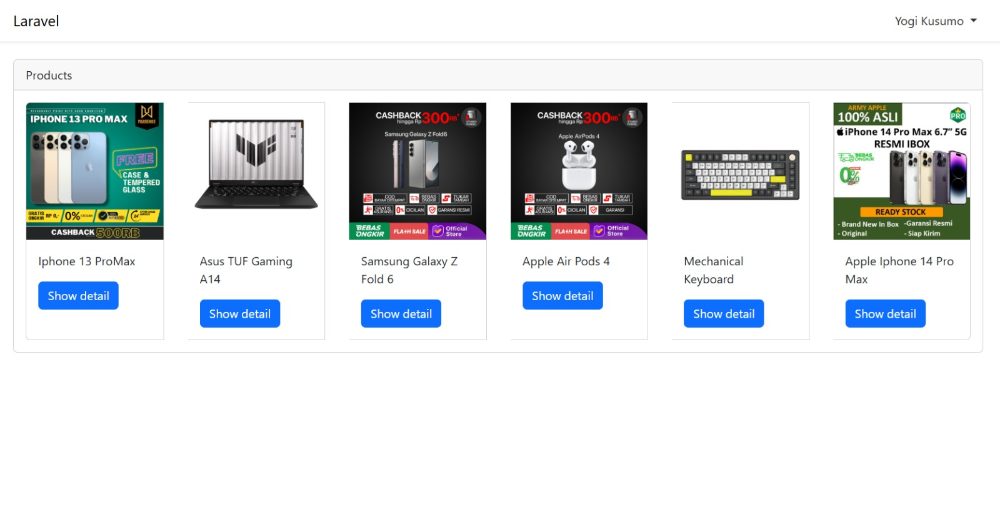
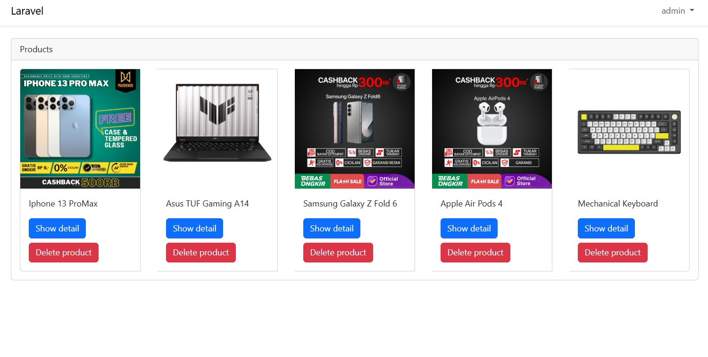
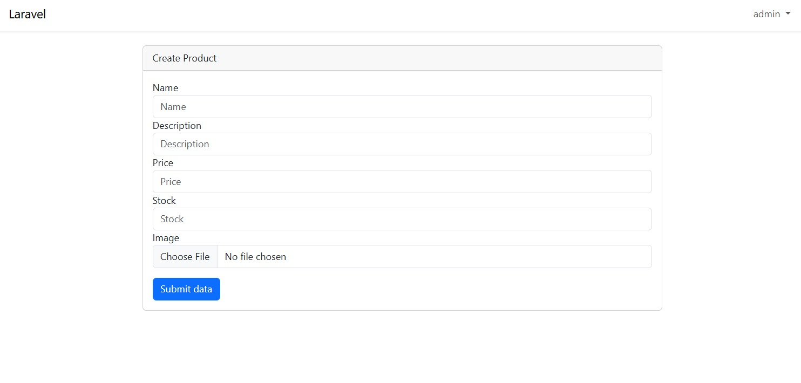
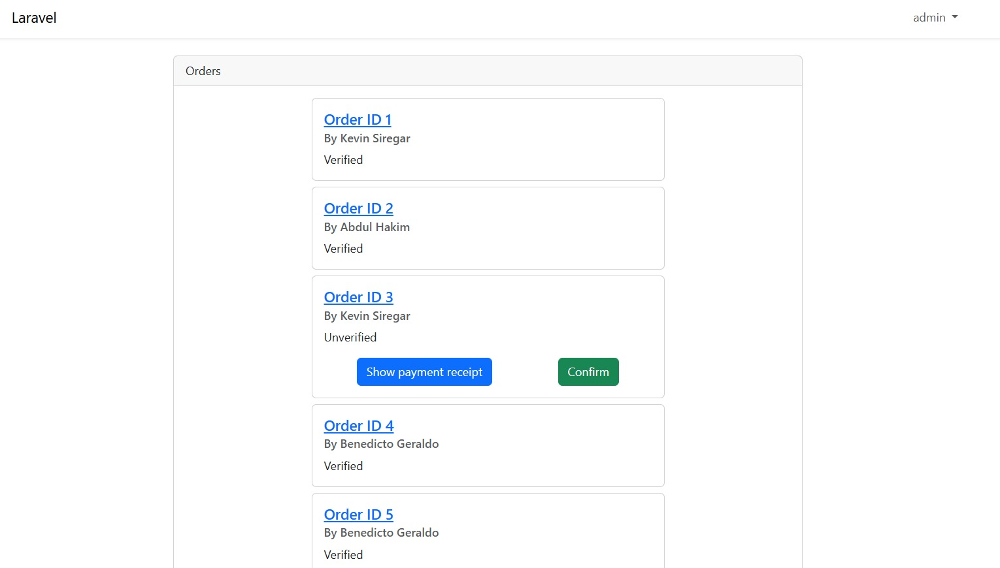

## About Project

This project is an e-commerce website for an online store. The website is built using the Laravel 9 framework and the MySQL database system. It is designed to be managed by the store admin, who can display products, delete products, confirm orders, and update product statuses. On this website, the store admin will directly interact with customers making purchases.

## User Role
- **Admin**
  - **Delete Product**
    

    
The admin can delete products that have been added to the product page. Additionally, the admin can view the details of the displayed products.

  - **Add Product**
    

    
The admin can add new products to the product page by inputting several details such as the product name, product description, product stock, product price, and product image.

  - **Confirm Payment and Orders**
    

    
The admin can view the list of incoming orders and the attached payment proofs. On this page, the admin can confirm orders.

- **Customer**
  - **View Product**
    
Users can view all the products available for sale on the website. User can also view the product's detail see more about the product

  - **Add To Cart Page**
    
When clicking the "show detail" button, users can add products to their cart. Additionally, users can remove items they are viewing from the cart.

  - **Checkout Page**
    
On the checkout page, users can view a summary of their purchase, including the total price, quantity of products purchased, and they can also upload payment proof on this page.

  - **Orders Page**
    
On this page, users can see all the orders they have placed. They can also check the status of their orders.

  - **Edit Profile Page**
    
On this page, users can update their account name and password.

